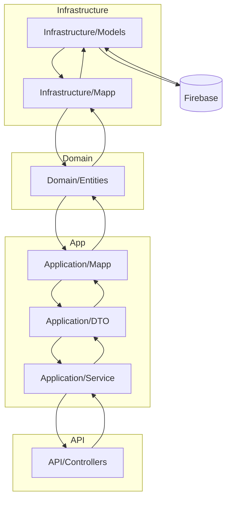

# 🏡 Convivia

**Facilitar el reparto justo y organizado de tareas domésticas.**

Convivia es una app móvil diseñada para mejorar la convivencia en pisos compartidos o residencias, ayudando a distribuir equitativamente las tareas del hogar. A través de una interfaz intuitiva y un sistema de niveles llamado **Karma**, los usuarios pueden organizar quién hace qué y cuándo, fomentando un entorno más justo y colaborativo.

## 📱 Tecnologías utilizadas
- Frontend: **React**
- Backend: **.NET**
- Diseño de interfaz: **Figma**
- Base de datos: **CosmosDB**

## ✨ Funcionalidades principales
- Crear y gestionar **residencias compartidas**
- Añadir y asignar **tareas domésticas**
- Visualizar actividades en un **calendario integrado**
- Recibir **recordatorios** automáticos
- Sistema de **niveles “Karma”** que recompensa a quienes más contribuyen

## 👥 Usuarios objetivo
- Personas que comparten piso
- Residencias colectivas con organización doméstica

## 🔐 Registro
Para usar Convivia, los usuarios deben crear una cuenta. El registro permite acceder a funcionalidades personalizadas, sincronización de datos y seguimiento del Karma.

## 🚀 Instalación
Disponible en plataformas móviles como **Play Store** y **App Store**. Solo tienes que buscar “Convivia” e instalarla.

## 📸 Ejemplos de uso
- _"Marta crea la residencia, asigna tareas semanales y consulta el calendario para ver quién está al día."_  
- _"Luis revisa su Karma y ve que necesita colaborar más para subir de nivel."_

## 📄 Licencia
Este proyecto está licenciado bajo la **Apache License 2.0**.  
Consulta el archivo `LICENSE` para más detalles.

## 📬 Contacto
¿Tienes preguntas, sugerencias o ganas de colaborar?  
Escríbenos a: **contacto@conviviaapp.com**

# Flujo del programa desacoplado

> El diagrama describe la arquitectura desacoplada de la aplicación tal y como se representa en el diagrama Mermaid incluido más abajo. La aplicación está organizada en dominios técnicos claramente separados: Infrastructure, Domain, Application y API, con Firebase como la fuente de persistencia.

