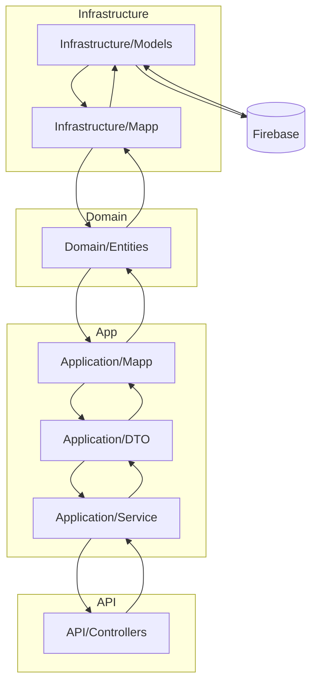

# Convivia

**Facilitar el reparto justo y organizado de tareas domésticas.**

Convivia es una app móvil diseñada para mejorar la convivencia en pisos compartidos o residencias, ayudando a distribuir equitativamente las tareas del hogar. A través de una interfaz intuitiva y un sistema de niveles llamado **Karma**, los usuarios pueden organizar quién hace qué y cuándo, fomentando un entorno más justo y colaborativo.

##  Tecnologías utilizadas
- Frontend: **React**
- Backend: **.NET**
- Diseño de interfaz: **Figma**
- Base de datos: **CosmosDB**

##  Funcionalidades principales
- Crear y gestionar **residencias compartidas**
- Añadir y asignar **tareas domésticas**
- Visualizar actividades en un **calendario integrado**
- Recibir **recordatorios** automáticos
- Sistema de **niveles “Karma”** que recompensa a quienes más contribuyen

## Usuarios objetivo
- Personas que comparten piso
- Residencias colectivas con organización doméstica

##  Registro
Para usar Convivia, los usuarios deben crear una cuenta. El registro permite acceder a funcionalidades personalizadas, sincronización de datos y seguimiento del Karma.

## Instalación
Disponible en plataformas móviles como **Play Store** y **App Store**. Solo tienes que buscar “Convivia” e instalarla.

##  Ejemplos de uso
- _"Marta crea la residencia, asigna tareas semanales y consulta el calendario para ver quién está al día."_  
- _"Luis revisa su Karma y ve que necesita colaborar más para subir de nivel."_

Copyright © 2026 Sergio Amador Lorente e inetum

All Rights Reserved.

Convivia is proprietary software.

This project is published exclusively for educational, research, demonstration, and portfolio purposes.

Permission is granted to view, study, fork, and modify the source code solely for personal, educational, or non-commercial purposes.

Without the prior written permission of the copyright holder, you may NOT:

- Use this software or any substantial portion of it for commercial purposes.
- Sell, sublicense, distribute, or monetize this software.
- Offer this software as a hosted service (SaaS) or commercial product.
- Create or distribute commercial derivative works based on this project.
- Remove or alter this copyright notice.

THE SOFTWARE IS PROVIDED "AS IS", WITHOUT WARRANTY OF ANY KIND, EXPRESS OR IMPLIED, INCLUDING BUT NOT LIMITED TO THE WARRANTIES OF MERCHANTABILITY, FITNESS FOR A PARTICULAR PURPOSE, AND NON-INFRINGEMENT.

Copyright © 2026 Sergio Amador Lorente e inetum. All rights reserved.

# Flujo del programa desacoplado

> El diagrama describe la arquitectura desacoplada de la aplicación tal y como se representa en el diagrama Mermaid incluido más abajo. La aplicación está organizada en dominios técnicos claramente separados: Infrastructure, Domain, Application y API, con Firebase como la fuente de persistencia.

